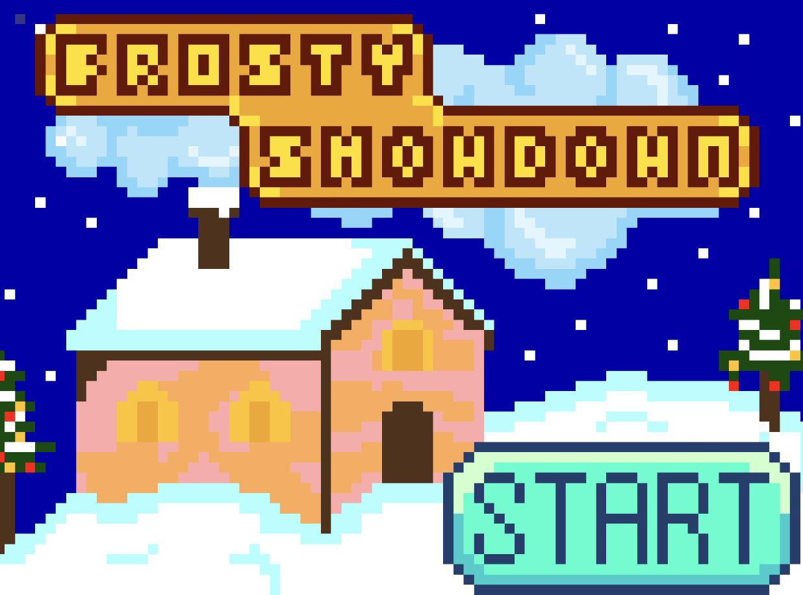
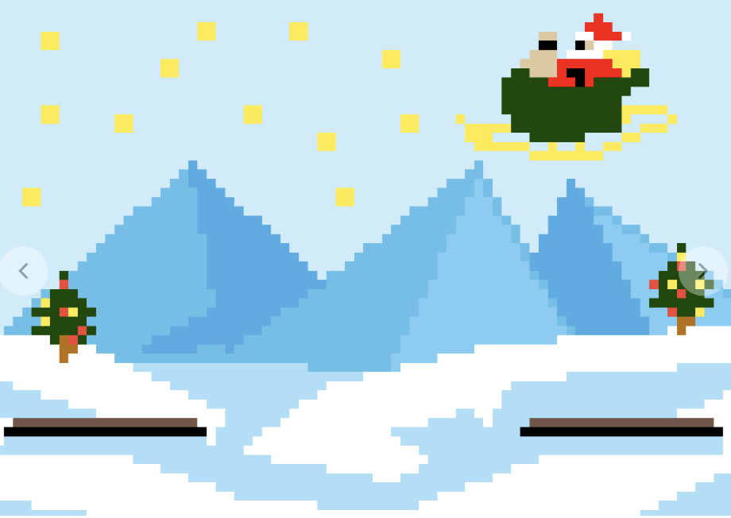

# frosty_showdown
2 Player Snowball throwing game designed for an Upduino board and 2 NES controllers. Created for final project ES4 (Intro to Digital Logic) at Tufts University.

&nbsp;&nbsp;&nbsp;&nbsp;Frosty Showdown is a 2D pvp game in which two snowmen, implemented with movement by NES controllers, throw snowballs at each other in an attempt to hit each other. Once one snowman hits the other, the game ends, which transitions to the respective player winning!

&nbsp;&nbsp;&nbsp;&nbsp;The game initially presents users with a welcome screen, prompting them to press start on either controller. Once the start button is pressed and held on the NES controller, users are brought into the main game state where the aim of the game is to fire a snowball and hit their opposing player. Players can move left or right with the NES controls in order to close out the other snowman as well as perform a jump animation within the game in order to add an extra dimension to the snowmen. The game's jumping motion adds an extra dimension to the game as once players press the up arrow key, they are stuck in the jump animation. Players can also time their snowball firing with the other player’s jump animation so that the snowball fires and hits the other player while stuck in the jump animation.

&nbsp;&nbsp;&nbsp;&nbsp;Each player gets one snowball to fire at a time by pressing the “A” button on the controller. Pressing the “A” button multiple times leads to the snowball resetting so properly timing the firing animation is key to winning the game.
When a snowball hits a player, the game exits the main game control state and into either the player 1 win state, or the player 2 win state. Players must then go past this state to the game over state, which triggers a “Game Over” display. Players will then need to manually re-enter the starting animation state.

&nbsp;&nbsp;&nbsp;&nbsp;Frosty Showdown is a hyper-addictive 2-player smash brothers-style game. Players duel off against each other dodging snowballs and voraciously trying to avoid one another.

